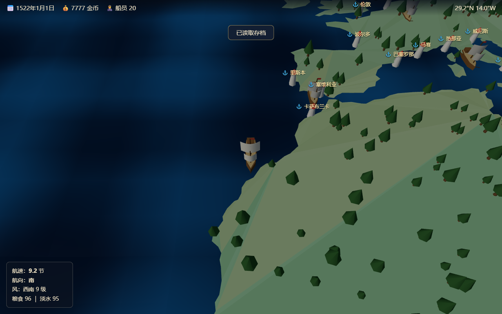

# 大航海时代 II · Three.js 复刻

用 **Three.js + TypeScript** 复刻 1994 年光荣经典游戏《大航海时代 II》（Uncharted Waters: New Horizons）的浏览器游戏。低多边形（low-poly）3D 画风，斜俯视视角，真实世界地图。



## 运行

```bash
npm install
npm run dev        # 开发服务器
npm run build      # 类型检查 + 生产构建
npm test           # vitest 单元测试
npm run preview    # 预览构建产物
```

## 玩法

从里斯本近海的一艘卡拉维尔帆船开始，低买高卖积累财富，组建舰队，袭击商队，纵横七海。

- **40+ 真实港口**：里斯本、伦敦、威尼斯、果阿、马六甲、澳门、长崎、哈瓦那……
- **贸易系统**：24 种商品，各区域有产地/销地差价（印度买胡椒卖到欧洲！），价格指数随时间与交易量波动
- **风帆航行**：信风带/西风带风场模拟，横风最快、正逆风停滞；注意粮食淡水消耗
- **港口小镇**：下船行走，进入市场/造船厂/酒馆/总督府
- **舰队经营**：8 级船型（拉丁帆船 → 盖伦帆船 → 飞剪船），买船/修理/招募船员
- **海战**：袭击 NPC 商队，舷侧齐射实时炮战，缴获战利品
- **昼夜循环**、**自动存档**（localStorage，每 15 秒 + 进出港）

### 操作

| 按键 | 功能 |
| --- | --- |
| W / ↑ | 扬帆 / 收帆（港口内移动） |
| A、D / ←、→ | 转向（港口内移动） |
| E | 进入港口/建筑、出港 |
| B | 袭击附近的 NPC 商队 |
| F | 舰队总览 |
| H | 帮助 |
| 滚轮 | 缩放地图 |
| ESC | 关闭面板 |

## 架构

```
src/
├── main.ts               # 入口：加载地图数据、启动游戏
├── core/
│   ├── Game.ts           # 主控：渲染器、主循环（rAF + dt 钳制）、场景切换、存档
│   ├── State.ts          # 全局游戏状态（可 JSON 序列化）
│   ├── Input.ts          # 键盘/滚轮采集
│   ├── SceneManager.ts   # 场景接口与切换（世界 ⇄ 港口 ⇄ 海战）
│   └── SaveSystem.ts     # localStorage 存档
├── world/
│   ├── WorldMap.ts       # TopoJSON → 低多边形陆地（earcut 三角化）+ 陆地碰撞掩码 + 树木
│   ├── Ocean.ts          # 海面 shader（顶点波动 + 屏幕空间导数平直法线）
│   ├── Sky.ts            # 昼夜循环（太阳/半球光/背景色/星空）
│   ├── Wind.ts           # 纬度带风场（信风/西风/极地东风）
│   └── projection.ts     # 经纬度 ⇄ 平面坐标、经度环绕
├── entities/             # 程序化低多边形模型：帆船、小人、NPC 商队
├── scenes/
│   ├── WorldScene.ts     # 世界地图航行
│   ├── PortScene.ts      # 港口小镇行走
│   └── BattleScene.ts    # 海战
├── systems/              # 纯逻辑（可单测）：经济、导航、造船厂、酒馆、战斗
├── ui/                   # DOM 覆盖层：HUD、市场、造船厂、酒馆、舰队、模态框
└── data/                 # ports.json / goods.json / ships.json
```

### 关键设计

- **世界地图**：Natural Earth 110m 陆地轮廓（TopoJSON，55KB），等距圆柱投影，earcut 三角化后渲染 3 份拷贝实现经度环绕；跨 ±180° 的多边形先做经度展开（孔洞环按外环对齐），避免垃圾三角形。
- **碰撞**：三角化同时把多边形光栅化到离屏 canvas 作为陆地掩码，航行时采样掩码判断撞陆；港口锚点自动吸附到最近水面。
- **游戏循环**：命令式代码、rAF 驱动、dt 钳制 0.1s；不引入状态管理库（参考原作重制版的架构说明，游戏循环持续轮询而非响应式）。
- **UI**：DOM 覆盖层与 canvas 完全解耦，面板打开时通过 `uiOpen` 暂停世界输入。
- **测试**：vitest 覆盖经济/导航/战斗纯逻辑；`scripts/*.mjs` 用 puppeteer-core + 系统 Chrome 做无头截图端到端验证。

## 数据来源与致谢

- 地图：[world-atlas](https://github.com/topojson/world-atlas)（Natural Earth 110m land）
- 灵感：光荣《大航海时代 II》(1994) 与 [JohanLi/uncharted-waters-2](https://github.com/JohanLi/uncharted-waters-2)
